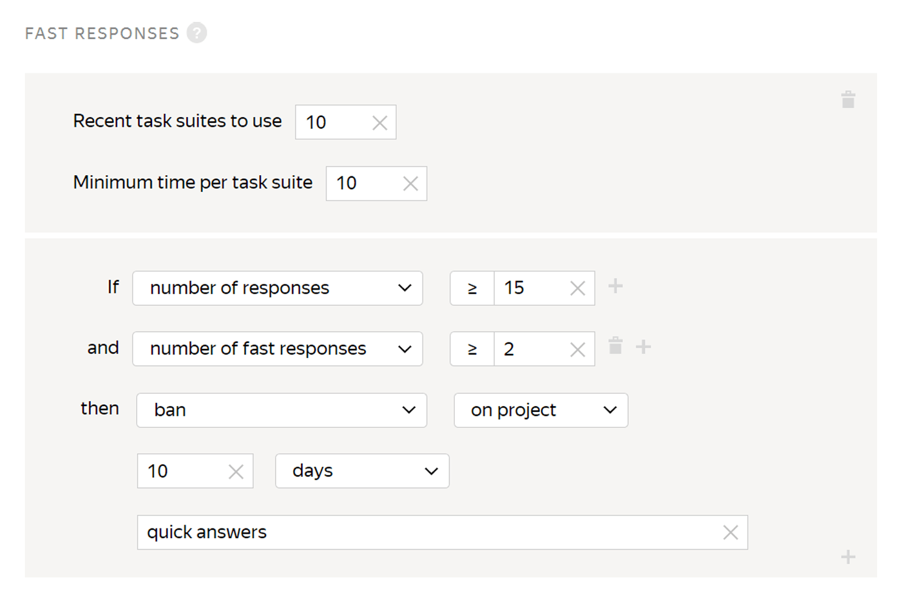
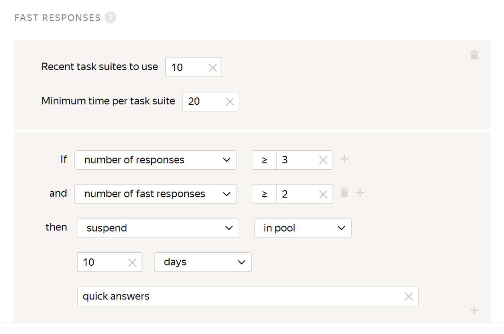

# Fast responses

This rule is necessary to filter out cheating Tolokers who complete tasks too quickly and carelessly. You can also use it to provide protection against robots that can distort the final results in the pool.



If you need additional protection from robots, use [captchas](captcha.md).



## When to use {#when-use}

Restrict the pool access for Tolokers who respond too quickly to:

- Restrict access for Tolokers who cheat in their responses. In this case, set the time required to complete a [task suite](../../glossary.md#task-suite) when giving random responses.

- Provide anti-robot protection. In this case, set twice as little time for task suite completion.

To estimate the time required to complete a task suite:

- [Complete a task in the sandbox](sandbox.md#self), if you didn't start the tasks yet.
- Look up the **Average assignment completion time** in [pool statistics](pool_statistic-pool.md#avgtime) if the tasks are already running.

## How do I set it up? {#rule}

#|
|| Field | Overview||
||**Recent task suites to use** | The number of recent assignments submitted by the Toloker.

If this field is not filled in, the calculation includes only recent task suites from the pool to which the rule applies.

If the field is filled in, the corresponding number of task suites is used. The rule takes into account the task suites from both this pool and other pools where this field is filled in.

To learn more about how this field works, go to [Parameter "Remember values"](remember-values.md).||
||**Minimum time per task suite** | The task suite completion time (in seconds). Everything that is completed faster is considered a fast response.||
||**If** | A condition for performing the action in the **then** field:
- **number of responses** — The number of the Toloker's recent responses (less than or equal to the number in the **Recent task suites to use** field).

- **number of fast responses** — Allowed number of fast responses (out of the recent ones).

To add multiple conditions, click .||
||**then** | Action to perform for the condition:

- **assign skill value** — Assign a fixed value to the Toloker's [skill](nav.md).

- **accept all assignments from this Toloker in the pool** — Requires the [non-automatic acceptance](offline-accept.md) option to be set.

    Useful if the Toloker completes most tasks well. Example: The Toloker completed more than 80% of the tasks correctly and you're satisfied with this result. The rule will work automatically and accept all responses in the pool.

- **suspend** — Suspend the Toloker's access to the pool for the specified number of days. Only the requester can view the reason.

- **ban** — Block access to the project or all of the requester's projects for the specified number of days. Only the requester can view the reason.

    If access to tasks is blocked temporarily (for example, for 7 days), the history of the Toloker's responses is not saved after the ban is lifted. The skill level is calculated based on the new responses.||
|#

## Examples of rules {#examples}

**Task**: you noticed that the pool closed too quickly and the final result was unsatisfactory. To prevent this from happening again, you decided to filter out Tolokers who complete tasks too quickly.

Examples are provided for simple [classification](../tutorials/image-classification.md). There are 10 tasks per suite.



The assignments submitted by banned Tolokers will be taken into account if you don't reject them manually using assignment review They can be reassigned by setting up the [Recompletion of assignments from banned users](restore-task-overlap.md) rule.



#### Blocking for fast responses



- Correct settings

  

  A Toloker who completes a task suite in less than 10 seconds will be banned and won't be able to access your tasks.

- Incorrect settings

  

  This rule will never take effect because the number of responses counted (**Recent task suites to use**) is less than the number of recent responses in the rule (**number of responses**).



#### Suspension in the pool for fast responses

A Toloker who completes two task suites in less than 20 seconds is suspended from accessing the pool and can't complete your tasks for 10 days.

## Troubleshooting {#troubleshooting}



Try completing the tasks yourself. Ask your colleagues and friends to complete them. Find out average completion time and add 50% to it.





It is better to use one [skill](../../glossary.md#skill) in a project. You can choose the way to calculate the skill:

- Calculate the skill for each pool separately. The current skill value is the value of the skill in the pool the Toloker completed last. This option is convenient if:

    - The pools are intended for different groups of Tolokers (for example, there are filters by city or country).

    - Pools are started one by one and you don't want to take into account the responses in the previous pools to calculate the skill in the current pool.

    This calculation method is used by default when adding a quality control rule to a pool. For the control tasks block, leave the **Recent control and training task responses to use** field empty.

- Calculate skill based on all tasks in a project This option is good if the pools are small and you don't need to have skill calculated for each pool.

    This option is available only for skills on control tasks. To use it, fill in the **Recent control and training task responses to use** field in pool quality control rules.





Yes, of course — you can use the same skill for different projects. But most often, a skill is intended for a specific project. If the Toloker completes a certain task well, this doesn't mean that they will complete other ones successfully. Another disadvantage is that if you filter by skills that were set long ago, you will artificially limit the number of available Tolokers.





Yes, the [fast response](quick-answers.md) settings specify the time per task suite.





You can't automatically reject the responses of a banned Toloker.

But you can do it yourself if you want. When downloading the results, select the option **Exclude assignments by banned users** to delete the responses of Tolokers who were banned at the moment of downloading. You can also forward all the assignments from banned Tolokers to other Tolokers using the [Re-completion of assignments from banned users](restore-task-overlap.md) rule.




