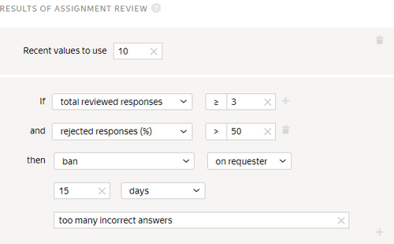
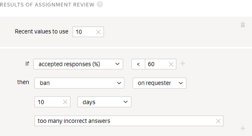
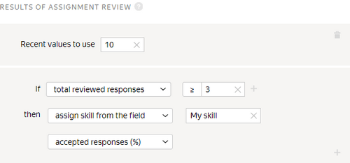

# Results of assignment review

If you don't want Tolokers who made a lot of mistakes to do your tasks in the future, set up this quality control rule.

## When to use {#when-use}

If [non-automatic acceptance](../../glossary.md#pool) (assignment review) is set in the [pool](offline-accept.md), add a rule to:

- Set the Toloker's [skill](../../glossary.md#skill) based on their responses.

- Block access for Tolokers who give incorrect responses.

To have rejected tasks redistributed to other Tolokers, set up the [Recompletion of rejected assignments](reassessment-after-accepting.md) rule.

## How to configure {#rule}



The **If** and **then** fields in this rule are mandatory. If you don't fill in at least one field, you won't be able to save the rule.



#|
|| **Field** | **Overview** ||
||**Recent values to use** | How many recent responses from the Toloker to use.

If this field is not filled in, the calculation includes only task responses from the pool to which the rule is applied.

If the field is filled in, the corresponding number of responses is used. The rule takes into account responses from both the current pool and other pools where this field is filled in.

To learn more about how this field works, go to [“Remember values” parameter](remember-values.md).||
||**If** | A condition for performing the action in the **then** field:

- **total reviewed responses** — The number of the Toloker's assignments that were reviewed.

- **accepted responses (%)** — The percentage of the Toloker's assignments that were accepted (from 0 to 100).

- **rejected responses (%)** — The percentage of the Toloker's assignments that were rejected (from 0 to 100).

To add multiple conditions, click .||
||**then** | Action to perform for the condition **If**:

- **suspend** — Suspend the Toloker's access to the pool for the specified number of days. Only the requester can view the reason.

- **assign skill value** — Assign a fixed value to the [skill](nav.md).

- **accept all assignments from this Toloker in the pool** — Requires the [non-automatic acceptance](offline-accept.md) option to be set.

    Useful if the Toloker completes most tasks well. Example: The Toloker completed more than 80% of the tasks correctly and you are satisfied with this result. The rule will work automatically and accept all responses in the pool.

- **ban** — Block access to the project or all of the requester's projects for the specified number of days. Only the requester can view the reason.

    If access to tasks is blocked temporarily (for example, for 7 days), the history of the Toloker's responses is not saved after the ban is lifted. The skill value is based on new responses.

- **assign skill from the field** — Save the percentage of Toloker's accepted responses as the [skill](nav.md) value.||
|#

## Examples of rules {#examples}

You understand that the Toloker didn't complete your tasks well enough. You can block this Toloker's access to tasks that you're going to do yourself.

You can also assign a skill that you can use to either block access to tasks for Tolokers, or to encourage those who did tasks well.

#### Blocking for incorrect responses



The assignments submitted by banned Tolokers will be taken into account if they are not rejected manually using assignment review They can be reassigned by setting up the [Recompletion of assignments from banned users](restore-task-overlap.md) rule.





- Correct settings

  

  If more than 50% of Toloker's responses are rejected, the Toloker is blocked and can't complete your tasks for 15 days.

- Incorrect settings

  

  The Toloker is blocked after the first rejected response, because the number of the reviewed tasks is not specified.



#### Setting the skill

After 3 tasks are reviewed, the skill is set to the percentage of correct responses. Use the skill value to set access to other pools with [filters](filters.md).





## Troubleshooting {#troubleshooting}



It is better to use one [skill](../../glossary.md#skill) in a project. You can choose the way to calculate the skill:

- Calculate the skill for each pool separately. The current skill value is the value of the skill in the pool the Toloker completed last. This option is convenient if:

    - The pools are intended for different groups of Tolokers (for example, there are filters by city or country).

    - Pools are started one by one and you don't want to take into account the responses in the previous pools to calculate the skill in the current pool.

    This calculation method is used by default when adding a quality control rule to a pool. For the control tasks block, leave the **Recent control task responses to use** field empty.

- Calculate skill based on all tasks in a project This option is good if the pools are small and you don't need to have skill calculated for each pool.

    This option is available only for skills on control tasks. To use it, fill in the **Recent control task responses to use** field in pool quality control rules.





Yes, of course — you can use the same skill for different projects. But most often, a skill is intended for a specific project. If the Toloker completes a certain task well, this doesn't mean that they will complete other ones successfully. Another disadvantage is that if you filter by skills that were set long ago, you will artificially limit the number of available Tolokers.





You can deny access to the pool if the Toloker's responses are [too fast](quick-answers.md), if they don't match the [majority vote](mvote.md), or if the Toloker makes too many mistakes in [control tasks](goldenset.md). Tasks completed by such Tolokers can be [given to other Tolokers](restore-task-overlap.md).





No. After sending a task, the Toloker can't make any changes to it. You can add tasks that were [completed](../../glossary.md#submitted-answers) incorrectly to a new pool.



