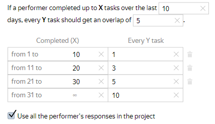

# Selective majority vote check

## Before you start {#before-start}

To set up **selective majority vote check**, you need a project, a pool, and a file with tasks.

## Theory {#theory}

This function allows you to set up [majority vote check](mvote.md) for only a portion of tasks.

Depending on how many tasks the Toloker completed in `N` days, [overlap](../../glossary.md#overlap) for certain tasks will be higher or lower than in the pool settings.



#### Reducing overlap

The pool's overlap is set to 4. To speed up pool completion and reduce data labeling costs, we'll reduce overlap for every third, fifth, and tenth task.

Toloker A completed 15 tasks in the last 10 days. Toloker B completed 30 tasks. Toloker C completed 60 tasks.

For Toloker A, overlap will be set to 3 for every third task; for Toloker B — for every fifth task; for Toloker C — for every tenth task.

This way we can reduce overlap for more experienced Tolokers.

#### Increasing overlap

The pool's overlap is set to 2. This project has experienced Tolokers who perform tasks well. We want to increase overlap for new Tolokers and check the experienced Tolokers' responses from time to time. To do this, we will increase overlap for every first, third, fifth, and tenth task.

Toloker A completed 5 tasks in the last 10 days. Toloker B completed 15 tasks. Toloker C completed 25 tasks. Toloker E completed 40 tasks.

For Toloker A, overlap will be set to 5 for every task; for Toloker B — for every third task; for Toloker C — for every fifth task; for Toloker E — for every tenth task.

This way we will increase overlap for inexperienced users and save money on the responses of experienced Tolokers.



#### When to use

Use **selective majority vote check** if:
- There are few or no control tasks in the project.

- You have experienced Tolokers whom you trust.

#### How verification tasks are assigned

- In the open pool, the verification tasks that haven't gained enough overlap are assigned to a Toloker.

- If there are no tasks of this kind in the open pool, they are transferred there from archived and closed pools that belong to the same project.

- If in the project there are no verification tasks with an overlap that is less than the specified value, a random task from the current open pool is assigned as a verification task.

## Practice {#practice}

To add **selective majority vote check**:

1. Upload tasks to the pool using [smart mixing](distribute-tasks-by-pages.md#smart-mixing).

1. Switch to pool editing mode.

1. Under **Smart mixing settings**, click .

1. Specify how many days the calculation should take into account, Tolokers, and overlap for majority vote tasks.

1. Set the intervals of completed tasks and the number of review tasks for each interval.





## Tips and recommendations {#help}

- Don't use **selective majority vote check** if:
    - There are many questions and many response options in the task.

    - Tolokers need to attach a file to their assignment.

    - Tolokers need to transcribe text or select objects in a photo, or other tasks where the Tolokers can't possibly provide the same responses.

- Use **selective majority vote check** together with the [fast responses](quick-answers.md) and [skipped assignments](skipped-assignments.md) quality control rules. This way, you will eliminate dishonest Tolokers who skip tasks or complete them too quickly, which directly affects the number of completed tasks and overlap.

## What's next {#what-next}

- [Add tasks to the pool](pool.md)
- Learn more about how to set up overlap:
    - [Dynamic overlap](dynamic-overlap.md)


