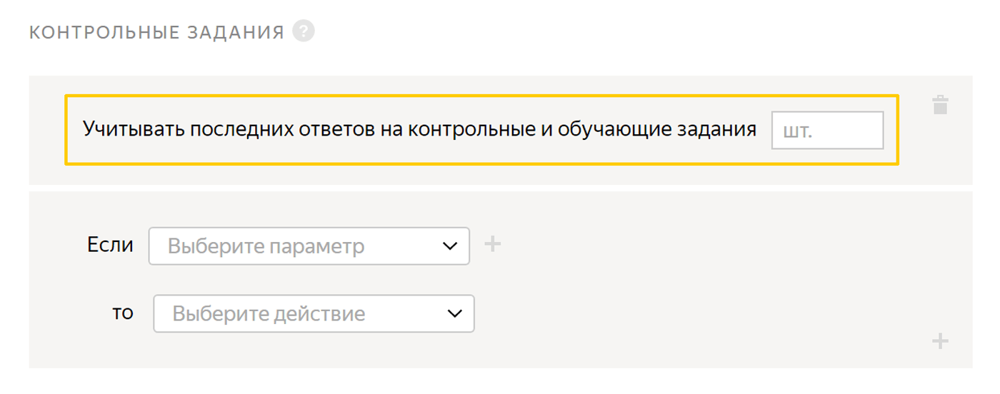
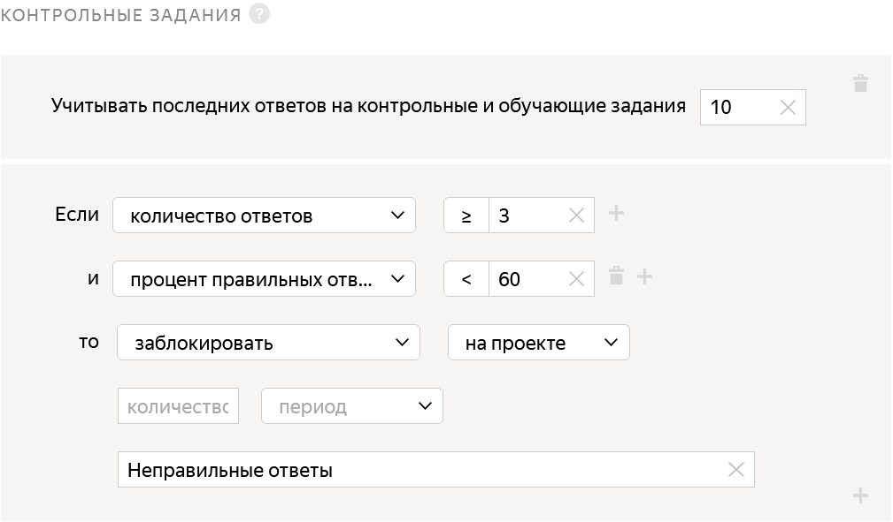
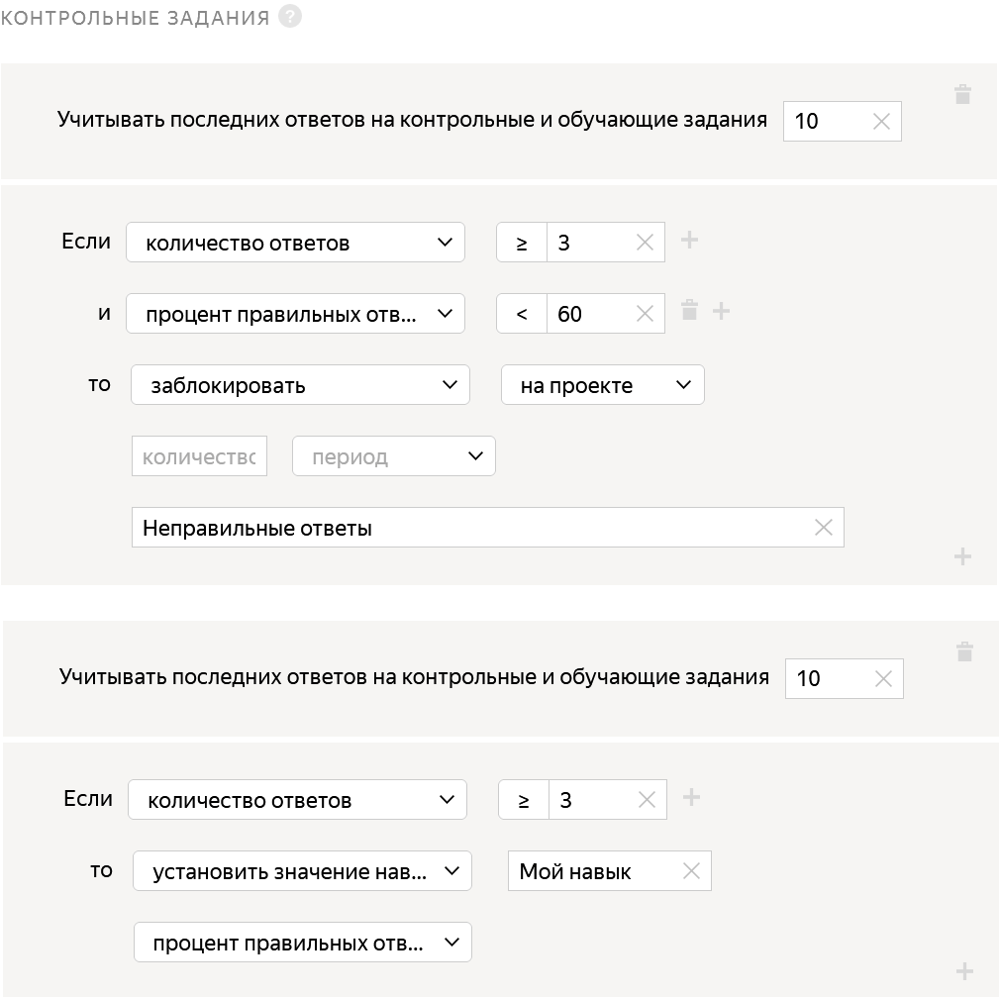
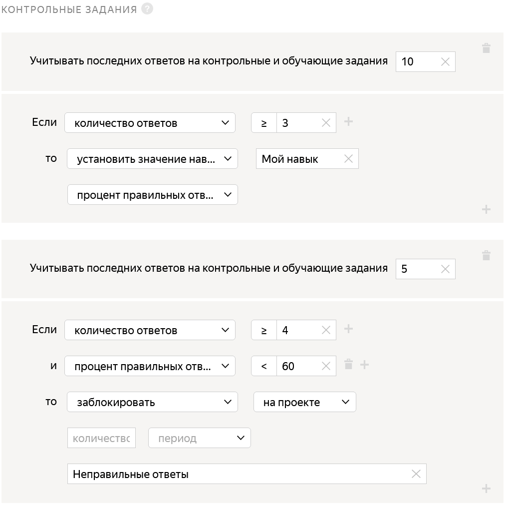

# Параметр «Помнить значений»



В некоторых правилах контроля качества есть параметр **Помнить значений**. Этот параметр устанавливает динамическое окно, равное N, в рамках которого будут пересчитываться значения. В зависимости от правила динамическое окно может измеряться:

- в заданиях — правила [Результаты проверки](reviewing-assignments.md) и [Мнение большинства](mvote.md), поле **Учитывать последних заданий**;

- в [контрольных заданиях](../../glossary.md#control-task) — правило [Контрольные задания](goldenset.md), поле **Учитывать последних ответов на контрольные и обучающие задания**;

- в [страницах заданий](../../glossary.md#task-suite) — правило [Быстрые ответы](quick-answers.md), поле **Учитывать последних страниц заданий**;

- в вводах [капчи](../../glossary.md#captcha) — правило [Капча](captcha.md), поле **Учитывать последних вводов капчи**.

## Как работает {#how-field-works}

Параметр **Помнить значений** одинаково работает для всех правил.

Рассмотрим работу параметра на примере правила [Контрольные задания](goldenset.md). Перейдите в настройки проекта или [пула](../../glossary.md#pool) и выберите это правило контроля качества.

Параметр **Помнить значений** в нашем примере задаетcя в поле **Учитывать последних ответов на контрольные и обучающие задания**.



- Поле не заполнено

  Толока учитывает все ответы на контрольные задания только в том пуле, к которому применяется правило.

  #### Пример

    Исполнитель делает несколько заданий в пуле А, где правило считает его навык. Затем он переходит в другой пул В с таким же правилом, где поле тоже не заполнено. В этом случае навык начинает считаться в пуле В заново. Правило из пула В ничего не знает про историю ответов исполнителя в пуле А.

- Поле заполнено

  Толока учитывает ответы на контрольные задания не только в том пуле, к которому применяется правило. Также учитываются ответы из других пулов, где было заполнено поле **Учитывать последних ответов на контрольные и обучающие задания**.

  #### Примеры

    - Исполнитель делает пул А с заполненным полем N = 10. Толока считает его навык по этому пулу в рамках N значений в 10 ответах на контрольные задания.

    - Далее он переходит в пул В, там поле в аналогичном правиле не заполнено. Толока забывает историю ответов исполнителя в пуле А и начинает считать навык только в рамках пула B.

    - Затем исполнитель переходит в пул С с заполненным полем N = 20. Толока забывает, что было в пуле В, но вспоминает, что было в пуле А, и продолжает считать навык в рамках последних 20 ответов на контрольные задания.

  

  

  Что это означает:

    - Как только исполнитель даст 3 ответа на контрольные задания, ему будет назначен навык, соответствующий проценту правильных ответов. С каждым последующим выполненным заданием навык будет пересчитываться.

    - В истории будут храниться ответы только на последние 10 контрольных значений, которые выполнил исполнитель. Как только он выполнит 11 контрольное задание, ответ на первое контрольное задание забудется.

  

  Условия правил, которые заданы на пуле:

  - Условие 1: **Учитывать последних ответов на контрольные и обучающие задания** = 10.
  - Условие 2: **Количество ответов** >= 3.
  - Условие 3: Назначить навык, как только сработало условие 2, и пересчитывать этот навык в рамках условия 1.

  № задания|Попадание в ответ на контрольное задание|Изменение навыка|Описание
  ----- | ----- | ----- | -----
  1 | 1 |  | Условие 1 ( Толока начинает запоминать историю ответов).
  2 | 0 |  | Условие 1 ( Толока продолжает запоминать историю ответов).
  3 | 1 | 66% — 2 верных из 3 | Условие 1 (в рамках последних 10 заданий), условие 2 (при хотя бы трех выполненных), условие 3 (назначить навык).
  4 | 1 | 75% — 3 верных из 4 | Условие 1 (в рамках последних 10 заданий), условие 2 (при хотя бы трех выполненных), условие 3 (продолжать считать навык).
  5 | 0 | 60% — 3 верных из 5 | Условие 1 (в рамках последних 10 заданий), условие 2 (при хотя бы трех выполненных), условие 3 (продолжать считать навык).
  6 | 1 | 66% — 4 верных из 6 | Условие 1 (в рамках последних 10 заданий), условие 2 (при хотя бы трех выполненных), условие 3 (продолжать считать навык).
  7 | 1 | 71% — 5 верных из 7 | Условие 1 (в рамках последних 10 заданий), условие 2 (при хотя бы трех выполненных), условие 3 (продолжать считать навык).
  8 | 0 | 62% — 5 верных из 8 | Условие 1 (в рамках последних 10 заданий), условие 2 (при хотя бы трех выполненных), условие 3 (продолжать считать навык).
  9 | 0 | 55% — 5 верных из 9 | Условие 1 (в рамках последних 10 заданий), условие 2 (при хотя бы трех выполненных), условие 3 (продолжать считать навык).
  10 | 0 | 50% — 5 верных из 10 | Условие 1 (в рамках последних 10 заданий), условие 2 (при хотя бы трех выполненных), условие 3 (продолжать считать навык).
  11 | 1 | 50% — 5 верных из 10 | Условие 1 (в рамках последних 10 заданий, здесь Толока забывает первый ответ), условие 2 (при хотя бы трех выполненных), условие 3 (продолжать считать навык).
  12 | 1 | 60% — 6 верных из 10 | Условие 1 (в рамках последних 10 заданий, Толока не помнит 2 самых первых ответа), условие 2 (при хотя бы трех выполненных), условие 3 (продолжать считать навык).

  

  

  

  

  Правило будет работать как в Примере 1 только:

  - Исполнителю не будет назначаться навык. Все вычисления Толока будет производить «в уме».

  - После каждого выполенного контрольного задания будет проверяться процент правильных ответов — больше 60 или нет. Если нет, то исполнитель будет заблокирован.

  При использовании такого правила сложно понять, почему исполнители были заблокированы, так как не видно изменения навыка у исполнителя. Поэтому очень часто используется комбинация двух правил (Пример 3).

  

  

  

  Правило работает как в Примере 1 и Примере 2 одновременно.

  

  

  

  При таких настройках сложно будет понять, почему исполнитель заблокирован несмотря на высокий навык.

  

  Условия правил, которые заданы на пуле:

  - Условие 1: **Учитывать последних ответов на контрольные и обучающие задания** = 5.
  - Условие 2: **Количество ответов** >= 4.
  - Условие 3: Как только сработало условие 2, проверить процент правильных ответов в рамках условия 1 и пересчитывать его.
  - Условие 4: Заблокировать исполнителя, если при условии 3 процент правильных ответов будет ниже 60.
  - Условие 5: **Учитывать последних ответов на контрольные и обучающие задания** = 10.
  - Условие 6: **Количество ответов** >= 3.
  - Условие 7: Назначить навык, как только сработало условие 6 и пересчитывать этот навык в рамках условия 5.

  № задания | Попадание в ответ на контрольное задание | Проверка на бан | Изменение навыка | Комментарий к бану | Комментарий к навыку
  ----- | ----- | ----- | ----- | ----- | -----
  1 | 1 |  |  | Условие 1 (Толока начинает запоминать историю ответов). | Условие 5 (Толока начинает запоминать историю ответов).
  2 | 1 |  |  | Условие 1 ( Толока продолжает запоминать историю ответов). | Условие 5 (Толока продолжает запоминать историю ответов).
  3 | 0 |  | 66% — 2 верных из 3 | Условие 1 (Толока продолжает запоминать историю ответов). | Условие 5 (в рамках последних 10 ответов на контрольные задания), условие 6 (при хотя бы трех выполненных контрольных заданиях), условие 7 (назначить навык).
  4 | 1 | 75% — 3 верных из 4 | 75% — 3 верных из 4 | Условие 1 (в рамках последних 5 ответов на контрольные задания), условие 2 (при хотя бы четырех выполненных контрольных заданиях), условие 3 (проверить процент правильных ответов). | Условие 5 (в рамках последних 10 ответов на контрольные заданиях), условие 6 (при хотя бы трех выполненных контрольных заданиях), условие 7 (пересчитать навык).
  5 | 1 | 80% — 4 верных из 5 | 75% — 3 верных из 4 | Условие 1 (в рамках последних 5 ответов на контрольные задания), условие 2 (при хотя бы четырех выполненных контрольных заданиях), условие 3 (проверить процент правильных ответов). | Условие 5 (в рамках последних 10 ответов на контрольные задания), условие 6 (при хотя бы трех выполненных контрольных заданиях), условие 7 (пересчитать навык).
  6 | 1 | 80% — 4 верных из 5 | 83% — 5 верных из 6 | Условие 1 (в рамках последних 5 ответов на контрольные задания, здесь Толока забывает первый ответ), условие 2 (при хотя бы четырех выполненных контрольных заданиях), условие 3 (проверить процент правильных ответов). | Условие 5 (в рамках последних 10 ответов на контрольные задания), условие 6 (при хотя бы трех выполненных контрольных заданиях), условие 7 (пересчитать навык).
  7 | 1 | 80% — 4 верных из 5 | 85% — 6 верных из 7 | Условие 1 (в рамках последних 5 ответов на контрольные задания, Толока не помнит 2 первых ответа), условие 2 (при хотя бы четырех выполненных контрольных заданиях), условие 3 (проверить процент правильных ответов). | Условие 5 (в рамках последних 10 ответов на контрольные задания), условие 6 (при хотя бы трех выполненных контрольных заданиях), условие 7 (пересчитать навык).
  8 | 1 | 100% — 5 верных из 5 | 87% — 7 верных из 8 | Условие 1 (в рамках последних 5 ответов на контрольные задания, Толока не помнит 3 первых ответа), условие 2 (при хотя бы четырех выполненных контрольных заданиях), условие 3 (проверить процент правильных ответов). | Условие 5 (в рамках последних 10 ответов на контрольные задания), условие 6 (при хотя бы трех выполненных контрольных заданиях), условие 7 (пересчитать навык).
  9 | 0 | 80% — 4 верных из 5 | 77% — 7 верных из 9 | Условие 1 (в рамках последних 5 ответов на контрольные задания, Толока не помнит 4 первых ответа), условие 2 (при хотя бы четырех выполненных контрольных заданиях), условие 3 (проверить процент правильных ответов). | Условие 5 (в рамках последних 10 ответов на контрольные задания), условие 6 (при хотя бы трех выполненных контрольных заданиях), условие 7 (пересчитать навык).
  10 | 0 | 60% — 3 верных из 5 | 70% — 7 верных из 10 | Условие 1 (в рамках последних 5 ответов на контрольные задания, Толока не помнит 5 первых ответов), условие 2 (при хотя бы четырех выполненных контрольных заданиях), условие 3 (проверить процент правильных ответов). | Условие 5 (в рамках последних 10 ответов на контрольные задания), условие 6 (при хотя бы трех выполненных контрольных заданиях), условие 7 (пересчитать навык).
  11 | 1 | 60% — 3 верных из 5 | 70% — 7 верных из 10 | Условие 1 (в рамках последних 5 ответов на контрольные задания, Толока не помнит 6 первых ответов), условие 2 (при хотя бы четырех выполненных контрольных заданиях), условие 3 (проверить процент правильных ответов). | Условие 5 (в рамках последних 10 ответов на контрольные задания, здесь Толока забывает первый ответ), условие 6 (при хотя бы трех выполненных контрольных заданиях), условие 7 (пересчитать навык).
  12 | 0 | 40% — 2 верных из 5 | 70% — 7 верных из 10 | Условие 1 (в рамках последних 10 ответов на контрольные задания, Толока не помнит 7 первых ответов), условие 2 (при хотя бы трех выполненных контрольных заданиях), условие 3 (продолжать считать навык), условие 4 (исполнитель заблокирован за качество ниже 60%). | Условие 5 (в рамках последних 10 ответов на контрольные задания, Толока не помнит 2 первых ответа), условие 6 (при хотя бы трех выполненных контрольных заданиях), условие 7 (пересчитать навык).

  На 12 задании исполнитель буде заблокирован за низкое качество, при этом процент его правильных ответов будет 60%.

  

  





- Если ранее вы заполнили поле **Учитывать последних ответов на контрольные и обучающие задания**, то изменить его на пустое нельзя. Но можно удалить правило и создать новое.
- Все правила, даже если они объединены одной сущностью, работают независимо.



## Как очистить историю ответов исполнителя {#clear-history}

Условия, при которых история ответов исполнителя будет очищена:

- Бан — в рамках динамического окна, если поле **Учитывать последних ответов на контрольные и обучающие задания** заполнено, или в рамках всего пула, если поле не заполнено.

- Пауза на пуле — в рамках всего пула, если поле не заполнено.

Как только бан или пауза будут сняты и исполнитель начнет выполнять задания, расчет будет производиться заново без учета ранее выполненных заданий.



Очищается история только того правила, для которого сработал бан.


